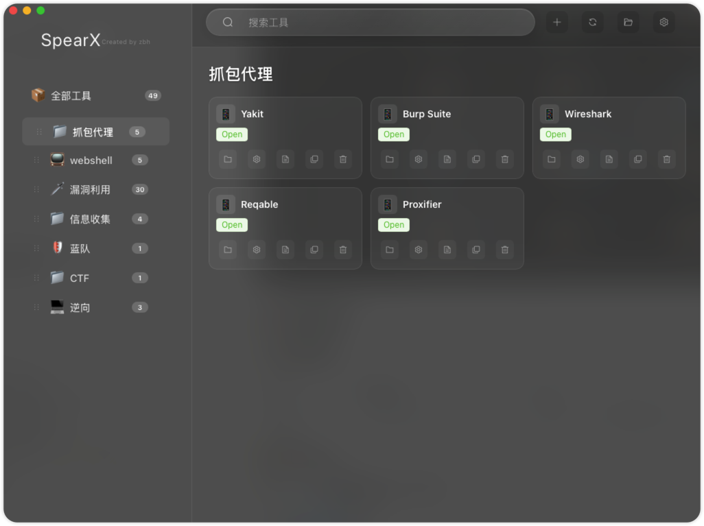

# SpearX - 现代化跨平台工具管理器

<div align="center">


[](https://tauri.app/)
[](https://www.rust-lang.org/)
[](https://vuejs.org/)
[](LICENSE)

**一款现代化的跨平台工具管理器，为开发者和安全研究人员打造**
**集成多种工具类型，支持智能分类管理和一键执行**
**原生毛玻璃界面 · 极简设计 · 强悍性能**

**Created by zbh** ⚡

[📖 功能特性](#-功能特性) • [🚀 快速开始](#-快速开始) • [📚 使用指南](#-使用指南) • [🔨 开发构建](#-开发构建)

</div>

---

## 📋 目录

- [✨ 功能特性](#-功能特性)
- [📸 截图预览](#-截图预览)
- [🚀 快速开始](#-快速开始)
- [📚 使用指南](#-使用指南)
- [⚙️ 配置说明](#️-配置说明)
- [🔨 开发构建](#-开发构建)
- [🏗️ 架构设计](#-架构设计)
- [❓ 常见问题](#-常见问题)

---

## ✨ 功能特性

### 🎯 核心功能

- **🔧 多工具类型支持**
  - ☕ **Java 应用** (Java 8/11/17) — 支持 JAR 包执行，多版本 Java 环境
  - 🖥️ **终端工具** — 在终端中打开工具目录，支持命令行工具
  - 🌐 **Web 应用/网站** — 浏览器中打开 URL
  - 📱 **本地应用程序** — 系统默认方式打开 APP、目录等
  - ⚡ **二进制文件** — 直接执行无扩展名的二进制可执行文件
  - 🔗 **自定义命令** — 灵活配置执行参数和命令

- **📁 智能管理**
  - 📂 分类组织管理，支持拖拽排序
  - 🏷️ 标签系统，快速标记和检索
  - 🔍 实时搜索过滤（名称/描述/路径/标签）
  - 📝 工具笔记和文档（Markdown 格式）
  - 🔄 自动扫描发现工具，智能识别工具类型

- **🎨 现代化界面**
  - 🌟 macOS 原生 NSVisualEffectView 毛玻璃效果
  - 🎭 流畅动画交互
  - 📱 响应式设计
  - 🌙 优雅的深色视觉
  - ⚡ 高性能渲染（Rust 后端 + WebView 前端）

### 🎯 核心优势

| 特性 | 说明 | 优势 |
|---|---|---|
| **极小体积** | Rust 编译，最终产物仅 ~6 MB | 比 Electron 小 15 倍 |
| **原生毛玻璃** | macOS NSVisualEffectView | 系统级视觉效果 |
| **多路径支持** | 相对路径、绝对路径、URL | 灵活的工具组织方式 |
| **智能扫描** | 自动发现工具目录，识别类型 | 快速导入现有工具 |
| **Java 多版本** | 支持 Java 8/11/17 | 兼容不同版本需求 |
| **安全模型** | Tauri v2 权限系统 | 细粒度 API 控制 |

---

## 📸 截图预览

### 主界面展示
> 原生毛玻璃效果，支持分类查看和智能搜索



---

## 🚀 快速开始

### 📋 系统要求

| 平台 | 最低版本 | 备注 |
|---|---|---|
| **macOS** | 12.0 (Monterey) | 推荐 13.0+，毛玻璃效果最佳 |

### 📦 安装方式

#### 方式一：下载预编译版本（推荐）

1. 前往 [Releases](https://github.com/mako-zbh/Spear-X/releases) 页面
2. 下载 `SpearX.dmg`
3. 打开 DMG，拖拽 SpearX 到 Applications 文件夹
4. 首次打开如提示安全警告，执行：
   ```bash
   xattr -rd com.apple.quarantine /Applications/SpearX.app
   ```

#### 方式二：从源码编译

```bash
# 1. 克隆仓库
git clone https://github.com/mako-zbh/Spear-X.git
cd Spear-X

# 2. 安装 Rust 工具链
curl --proto '=https' --tlsv1.2 -sSf https://sh.rustup.rs | sh

# 3. 安装 Tauri CLI
cargo install tauri-cli --version "^2.0.0"

# 4. 安装前端依赖
cd frontend && npm install && cd ..

# 5. 构建并打包 .app / .dmg
cargo tauri build

# 6. 运行
open src-tauri/target/release/bundle/macos/SpearX.app
```

### ⚡ 快速体验

1. **首次启动**：应用自动在用户目录创建默认配置
2. **添加工具**：点击 ➕ 按钮手动添加工具
3. **扫描工具**：使用 🔄 按钮扫描现有工具目录
4. **执行工具**：点击工具卡片即可一键执行

---

## 📚 使用指南

### 📖 基本操作

#### 1️⃣ 工具添加

```
三种添加方式：
1. ➕ 手动添加 — 逐个配置工具信息
2. 🔄 扫描 Resources 目录 — 自动发现内置工具
3. 📂 扫描自定义目录 — 选择任意目录批量导入
```

#### 2️⃣ 工具执行方式详解

##### ☕ Java 应用 (Java8 / Java11 / Java17)

**适用场景**：Java 开发的桌面应用、安全工具、开发工具等

- **支持格式**：`.jar` 文件
- **自动配置**：根据工具需求选择对应 Java 版本
- **内存管理**：支持自定义 JVM 参数如 `-Xmx2g`
- **环境隔离**：每个工具可独立配置 Java 环境

**配置示例**：
```yaml
- ToolName: Burp Suite Professional
  PATH: /Applications/Security/BurpSuite
  FileName: burpsuite_pro.jar
  VALUE: Java11                    # 使用 Java 11
  Optional: "-Xmx4g -XX:+UseG1GC"  # JVM 优化参数
```

**执行过程**：
1. 检测配置的 Java 版本路径
2. 如果未配置则使用系统默认 Java
3. 构建执行命令：`{java_path} {optional} -jar {jar_file}`
4. 在工具目录中后台执行，不阻塞界面

---

##### 🖥️ 终端工具 (openterm)

**适用场景**：命令行工具、脚本、需要终端交互的工具

- **支持格式**：可执行文件、脚本文件、工具目录
- **自动定位**：自动 `cd` 到工具目录
- **终端打开**：macOS 自动检测 iTerm / Terminal.app
- **环境保持**：保持工具的工作目录环境

**配置示例**：
```yaml
- ToolName: Nmap 网络扫描
  PATH: /usr/local/bin/nmap
  FileName: ""
  VALUE: openterm
```

---

##### 🌐 Web 应用 (Browser)

**适用场景**：在线工具、文档站点、搜索引擎快捷方式

- **支持格式**：HTTP/HTTPS URL
- **默认浏览器**：使用系统默认浏览器打开

**配置示例**：
```yaml
- ToolName: GitHub
  PATH: https://github.com
  FileName: ""
  VALUE: Browser
```

---

##### 📱 系统打开 (Open) / ⚡ 二进制 (Binary)

**适用场景**：macOS `.app` 应用、原生二进制文件

| 类型 | 说明 | 示例 |
|---|---|---|
| **Open** | 系统默认方式打开文件/APP | `Burp Suite.app` |
| **Binary** | 直接执行二进制文件 | 无扩展名的可执行文件 |

---

#### 3️⃣ 工具管理

| 操作 | 说明 |
|---|---|
| ✏️ **编辑工具** | 右键工具卡片 → 编辑，修改所有属性 |
| 🗑️ **删除工具** | 右键工具卡片 → 删除 |
| 📋 **拖拽排序** | 长按工具卡片拖拽，调整显示顺序 |
| 📝 **工具笔记** | 每个工具可附加 Markdown 格式笔记 |
| 🔍 **搜索过滤** | 输入关键词搜索，支持 `标签:xxx` 标签搜索 |

#### 4️⃣ 分类管理

| 操作 | 说明 |
|---|---|
| ➕ **添加分类** | 点击侧边栏底部 ➕ 按钮 |
| ✏️ **重命名分类** | 双击分类名称 |
| 🎨 **分类图标** | 点击分类右侧图标选择器 |
| 🗑️ **删除分类** | 右键分类 → 删除 |
| 📋 **拖拽排序** | 拖拽分类调整顺序 |

---

## ⚙️ 配置说明

### 📂 配置文件位置

配置文件存储在用户目录下，应用更新不会覆盖：

| 平台 | 路径 |
|---|---|
| **macOS** | `~/Library/Application Support/SpearX/tool.yml` |
| **Windows** | `%APPDATA%\SpearX\tool.yml` |
| **Linux** | `~/.config/spearx/tool.yml` |

### 📝 配置文件格式

```yaml
# Java配置
# 自定义Java路径配置，如果留空将使用系统默认Java
javapath:
  Java8: resources/java8/bin/java
  Java11: resources/java11/bin/java
  Java17: resources/java17/bin/java

Categories:
  - CategoryName: 信息收集
    Icon: 🔍
    Tools:
      - ToolName: WebFinder
        PATH: resources/info/webfinder
        FileName: webfinder-next.jar
        VALUE: Java8
        COMMAND: -jar
        Optional: ""
        Description: Web 资产发现工具
        Tags:
          - 信息收集
          - 子域名
```

### 🔧 字段说明

| 字段 | 说明 | 必填 |
|---|---|---|
| `ToolName` | 工具显示名称 | ✅ |
| `PATH` | 工具路径（相对/绝对/URL） | ✅ |
| `FileName` | 可执行文件名 | 视类型而定 |
| `VALUE` | 执行类型（Java8/Java11/Java17/Open/openterm/Browser/Binary） | ✅ |
| `COMMAND` | 执行命令模板 | ❌ |
| `Optional` | 附加参数（如 JVM 参数） | ❌ |
| `Description` | 工具描述 | ❌ |
| `Tags` | 标签列表 | ❌ |

---

## 🔨 开发构建

### 🛠️ 开发环境要求

| 工具 | 版本 | 用途 |
|---|---|---|
| **Rust** | 1.75+ | 后端开发语言 |
| **Node.js** | 18+ | 前端构建工具 |
| **Tauri CLI** | v2 | 桌面应用框架 |

```bash
# 安装 Rust
curl --proto '=https' --tlsv1.2 -sSf https://sh.rustup.rs | sh

# 安装 Tauri CLI
cargo install tauri-cli --version "^2.0.0"

# 安装前端依赖
cd frontend && npm install
```

### 💻 开发模式（热重载）

```bash
cargo tauri dev
```

启动后：
- Rust 代码变更自动重新编译
- 前端代码通过 Vite 热重载
- Vite 开发服务器运行在 `http://localhost:9245`

### 📦 生产构建

```bash
# 构建并打包（.app + .dmg）
cargo tauri build
```

产物位置：
```
src-tauri/target/release/bundle/macos/SpearX.app
src-tauri/target/release/bundle/dmg/SpearX_3.0.0_aarch64.dmg
```

### 🧪 运行测试

```bash
cd src-tauri && cargo test
```

### 🔧 技术栈

#### 前端

| 技术 | 说明 |
|---|---|
| **Vue 3** | Composition API |
| **Element Plus** | UI 组件库 |
| **Vite 5** | 构建工具 |
| **CSS3** | Liquid Glass 效果 + 毛玻璃 |

#### 后端

| 技术 | 说明 |
|---|---|
| **Rust** | Edition 2021 |
| **Tauri v2** | 桌面应用框架 |
| **serde_yaml** | YAML 配置解析 |
| **window-vibrancy** | macOS 原生毛玻璃 |
| **tauri-plugin-shell** | 进程执行 |
| **tauri-plugin-dialog** | 文件对话框 |

---

## 🏗️ 架构设计

```
┌─────────────────┐    ┌─────────────────┐
│   Frontend      │    │   Backend       │
│   (Vue 3)       │◄──►│   (Rust)        │
├─────────────────┤    ├─────────────────┤
│ • UI 组件       │    │ • 工具管理      │
│ • 状态管理      │    │ • 文件操作      │
│ • 事件处理      │    │ • 命令执行      │
│ • 毛玻璃 CSS    │    │ • 配置管理      │
└─────────────────┘    └─────────────────┘
         ▲                       ▲
         │   Tauri IPC (invoke)  │
         ▼                       ▼
┌─────────────────┐    ┌─────────────────┐
│   WebView       │    │   System        │
│   (系统原生)     │    │   Integration   │
│   NSVisualEffect│    │   osascript     │
└─────────────────┘    └─────────────────┘
```

### 📁 项目结构

```
Spear-X/
├── src-tauri/              # Rust 后端
│   ├── src/
│   │   ├── main.rs         # 入口 + 命令注册 + 毛玻璃初始化
│   │   ├── models.rs       # 数据模型 (YAML/JSON 双结构体)
│   │   ├── config.rs       # 配置读写 + 原子保存
│   │   ├── executor.rs     # 工具执行引擎
│   │   ├── scanner.rs      # 目录扫描 + 类型识别
│   │   ├── notes.rs        # Markdown 笔记管理
│   │   ├── platform/       # 平台抽象 (macOS/Windows/Linux)
│   │   └── commands/       # 49 个 Tauri 命令
│   ├── Cargo.toml
│   └── tauri.conf.json
├── frontend/               # Vue 3 前端
│   └── src/
│       ├── App.vue         # 主界面
│       ├── api/index.ts    # IPC 调用封装
│       └── styles/main.css # 全局样式
├── tool.yml                # 默认配置模板
└── docs/                   # 文档
```

---

## ❓ 常见问题

### 🔧 环境配置问题

**Q: 运行程序显示文件损坏不能打开？**

> 首次运行提示验证签名失败，执行：
> ```bash
> xattr -rd com.apple.quarantine SpearX.app
> ```

**Q: Java 工具无法执行？**

> 1. 确认已安装对应 Java 版本
> 2. 在 Java 配置中设置正确的 Java 路径
> 3. 或保持路径为空使用系统默认 Java

### 🚀 使用问题

**Q: 如何添加自定义工具？**

> 1. 点击 ➕ 按钮手动添加
> 2. 使用 📂 按钮扫描包含工具的目录

**Q: 工具笔记保存在哪里？**

> 笔记以 Markdown 格式保存在工具所在目录下，文件名为 `工具名.md`

**Q: 支持哪些文件格式？**

> - Java: `.jar`
> - Windows: `.exe`, `.bat`, `.cmd`
> - macOS: `.app`, `.sh`
> - Linux: `.sh`, `.py`, 无扩展名可执行文件
> - Web: HTTP/HTTPS URL

**Q: 配置如何备份？**

> 备份 `~/Library/Application Support/SpearX/tool.yml` 即可。笔记文件保存在各工具目录中。

---

## 📄 License

[MIT License](LICENSE)

---

## 致谢

本项目基于 [sspsec/Spear](https://github.com/sspsec/Spear) 二次开发，感谢原项目作者 [Spe4r](https://github.com/sspsec) 的开源贡献。

技术栈由 Wails v3 (Go) 迁移至 [Tauri v2](https://tauri.app/) (Rust)。
